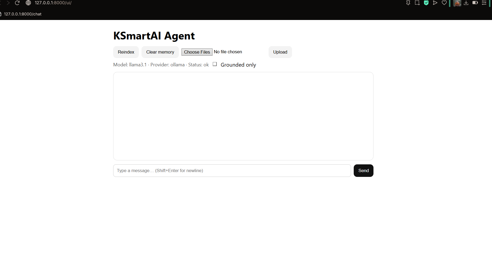

# KSmartAI Agent — Local RAG Chatbot (Ollama + FastAPI + Web UI)

Runs fully local (no cloud keys):
- Per-user **conversation memory** (last 8 turns)
- **RAG** over your docs (TXT/MD/PDF) with local embeddings
- **Upload** files from the browser (auto-reindex)
- Minimal **Web UI** served by FastAPI
- **Ollama** backend (free)

## Quickstart

**IntelliJ / VS Code**
- Open the folder and run **`run.py`** (press ▶).
- Open **http://127.0.0.1:8000/** (redirects to the UI).

**Windows (PowerShell)**
```powershell
.\scripts\start.ps1
$ErrorActionPreference = "Stop"
python -m venv .venv
.\.venv\Scripts\python.exe -m pip install --upgrade pip
.\.venv\Scripts\python.exe -m pip install -r requirements.txt
.\.venv\Scripts\python.exe run.py

```
**macOS/Linux**
``` powershell
./scripts/start.sh
#!/usr/bin/env bash
set -e
python3 -m venv .venv
. .venv/bin/activate
python -m pip install --upgrade pip
pip install -r requirements.txt
python run.py

```
---
## Prerequisites 
- Python 3.11+ (3.13 OK)

- Ollama at http://localhost:11434

**Install & pull models (Windows PowerShell):**
```powershell
winget install Ollama.Ollama
ollama pull llama3.1
ollama pull nomic-embed-text
```
---
## Create .env(or copy .env.example)
### Create `.env` (or copy `.env.example`)
Put a `.env` file at the repo root to configure the app:

```dotenv
PROVIDER=ollama
OLLAMA_MODEL=llama3.1
EMBED_MODEL=nomic-embed-text
SYSTEM_PROMPT=You are a concise, helpful assistant. If unsure, say so.
SAFE_MODE=true
HOST=127.0.0.1
PORT=8000
```
---
## Troubleshooting
- Blank page / 404 at / → use http://127.0.0.1:8000/
(don’t open file://web/index.html).

- ollama-unreachable → start Ollama; check curl http://localhost:11434/api/tags.

- Port busy (8000) → on Windows:

---
## License
**MIT © 2025 Kartikeya Sharma**